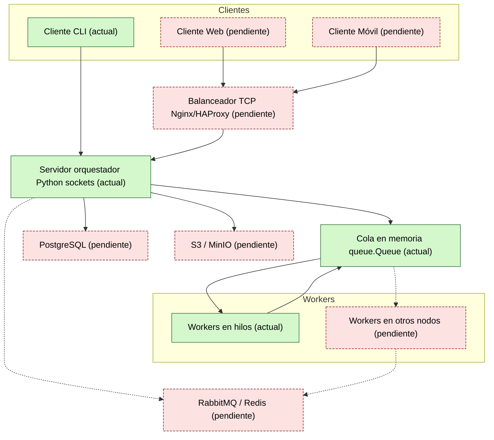

# PFO3 · Sistema distribuido simple (cliente-servidor)

Este repositorio es mi entrega del PFO3. La idea es tomar el trabajo anterior y separarlo en cliente, servidor y pequeños workers usando sockets.

## Qué hay acá

- `src/servidor.py`: servidor que escucha por TCP, reparte tareas a un pool de hilos y responde al cliente.  
- `src/cliente.py`: programa para mandar tareas y ver la respuesta. Permite modo menú o argumentos por consola.  
- `docs/diagram.drawio`: archivo editable del diagrama.  
- `docs/diagram.md`: versión con Mermaid que se ve acá debajo.

## Componentes principales

- Clientes web o móviles que hablan por TCP (en local usamos `python src/cliente.py`).
- Un balanceador (Nginx/HAProxy) pensado para futuro; en pruebas se apunta directo al servidor.
- Servidor orquestador con una cola (`queue.Queue`) y varios workers en hilos.
- Workers que procesan la tarea y devuelven el resultado.
- Lugares opcionales para guardar datos: PostgreSQL y S3/MinIO.




## Paso a paso del flujo

1. El cliente arma un JSON simple y lo envía al servidor usando sockets.
2. El servidor mete la tarea en la cola y algún worker libre la toma.
3. El worker procesa (mayúsculas, invertir texto, contar palabras o `sleep`) y deja el resultado en una cola de respuesta.
4. El servidor lee la respuesta y se la manda al cliente.

En este prototipo todo vive en memoria para que sea fácil de probar, pero la estructura queda lista para cambiar la cola por RabbitMQ y persistir resultados.

`Verde = ya implementado`. `Rojo = pendiente por construir`.

## Cómo ejecutar

1. Requisito único: Python 3.9+ (usa solo la librería estándar).
2. En una terminal levantar el servidor:

   ```bash
   python3 src/servidor.py
   ```

3. En otra terminal enviar una tarea:

   ```bash
   python3 src/cliente.py --tipo uppercase --contenido "hola mundo"
   ```

   Si preferís menú interactivo, corré `python3 src/cliente.py` sin parámetros.

## Tareas que entiende el servidor

| Código | Clave        | Qué hace                           |
|--------|--------------|------------------------------------|
| `1`    | `uppercase`  | Devuelve el texto en mayúsculas.   |
| `2`    | `reverse`    | Invierte la cadena.                |
| `3`    | `word_count` | Cuenta palabras separadas por espacios. |
| `4`    | `sleep`      | Duerme la cantidad de segundos indicada. |

Podés agregar nuevas tareas editando `procesar_tarea` en `src/servidor.py`.
