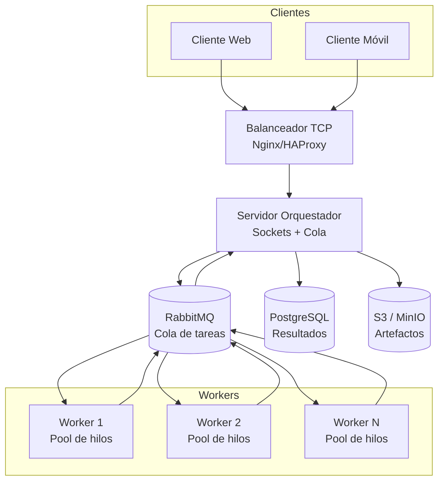

# Diagrama de arquitectura distribuida

## Flujo operacional

1. **Clientes** web o móviles establecen una conexión TCP (idealmente TLS) contra el balanceador de carga. En desarrollo se puede apuntar directamente al servidor orquestador.
2. El **balanceador (Nginx/HAProxy)** distribuye las conexiones entrantes entre varias réplicas del orquestador, asegurando alta disponibilidad.
3. El **servidor orquestador** valida el mensaje, lo publica en la cola de tareas (RabbitMQ) y espera la respuesta usando una cola de retorno (reply-to).
4. Los **workers** consumen tareas desde la cola, las procesan utilizando pools de hilos locales y publican los resultados en la cola de respuestas.
5. El **orquestador** recoge la respuesta y la devuelve al cliente. Opcionalmente persiste el resultado estructurado en **PostgreSQL** y archivos o reportes binarios en **S3/MinIO**.

El prototipo incluido en `src/` trabaja completamente en memoria (cola `queue.Queue`) para facilitar las pruebas locales, pero respeta el mismo flujo, por lo que la migración a RabbitMQ es directa.
